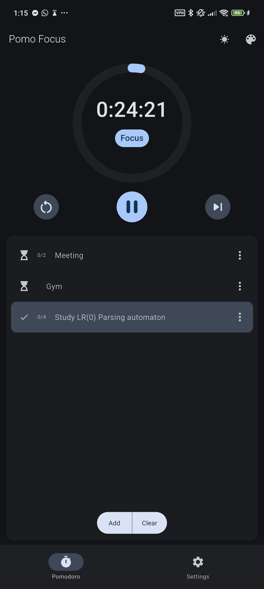
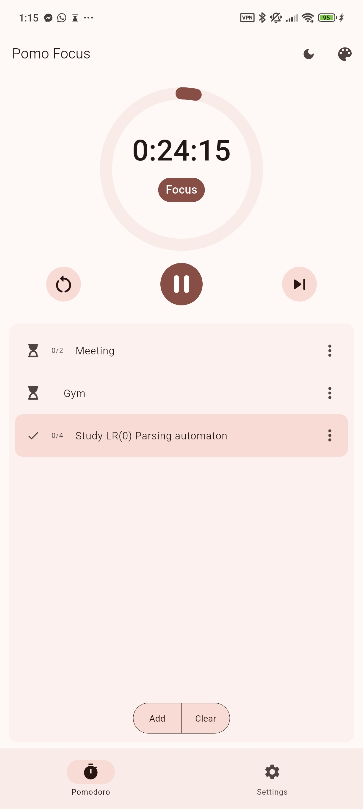
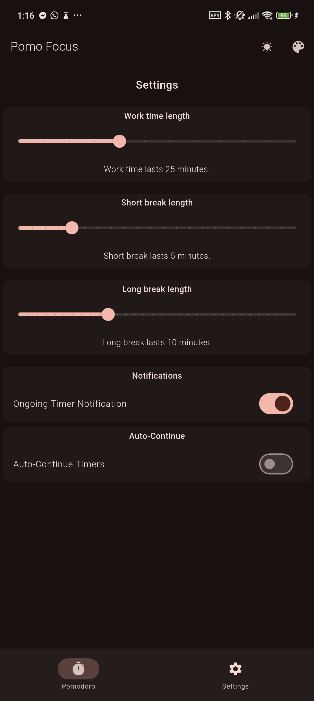
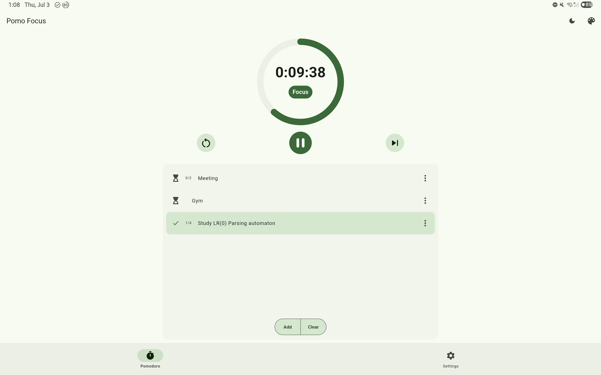

# Pomo Focus

A simple pomo app made with flutter.

Available on the [playstore](https://play.google.com/store/apps/details?id=com.zeykafx.pomo_focus)

## Features
- Configurable timers (Work, short and long break)
- Integrated task list with number of sessions for each task
- Notification with timer
- Audible notification sound

## Images

