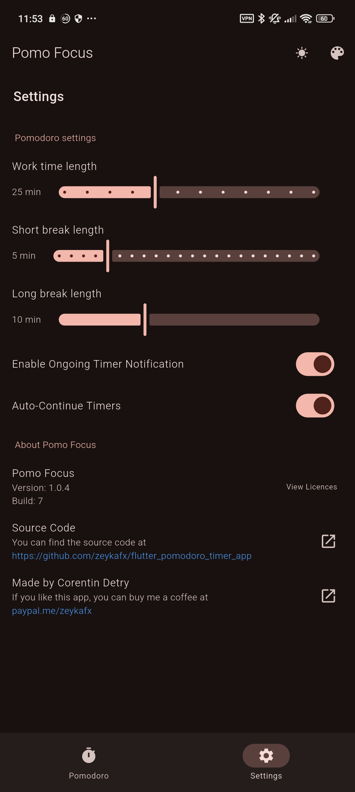

# Pomo Focus

A simple pomo app made with flutter.

Available on the [playstore](https://play.google.com/store/apps/details?id=com.zeykafx.pomo_focus) or from the [github release page](https://github.com/zeykafx/flutter_pomodoro_timer_app/releases)

## Features
- Configurable timers (Work, short and long break)
- Integrated task list with number of sessions for each task
- Notification with timer
- Audible notification sound

## Installation

- Download from the [playstore](https://play.google.com/store/apps/details?id=com.zeykafx.pomo_focus)
- Download the apk from the [github release page](https://github.com/zeykafx/flutter_pomodoro_timer_app/releases)

## Images

## Other

If you like this app, you can buy me a coffee at [https://paypal.me/zeykafx](https://paypal.me/zeykafx)
